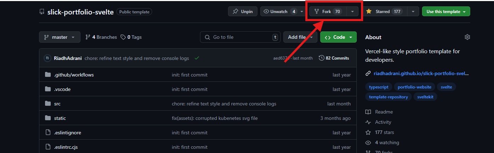
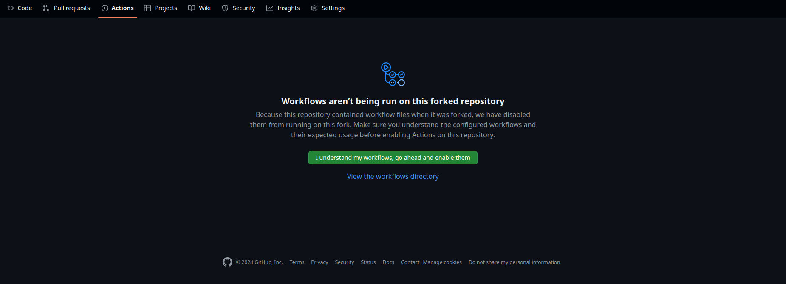
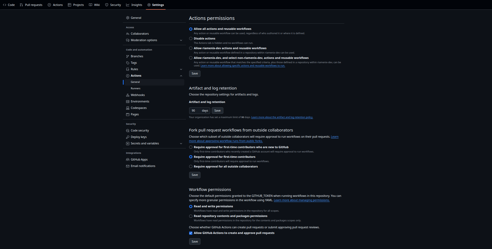
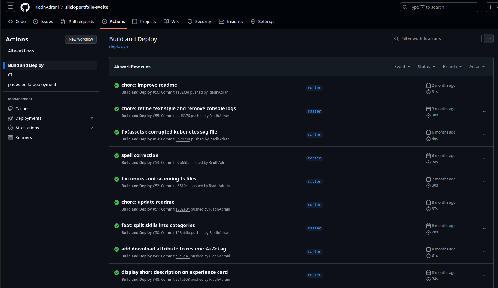
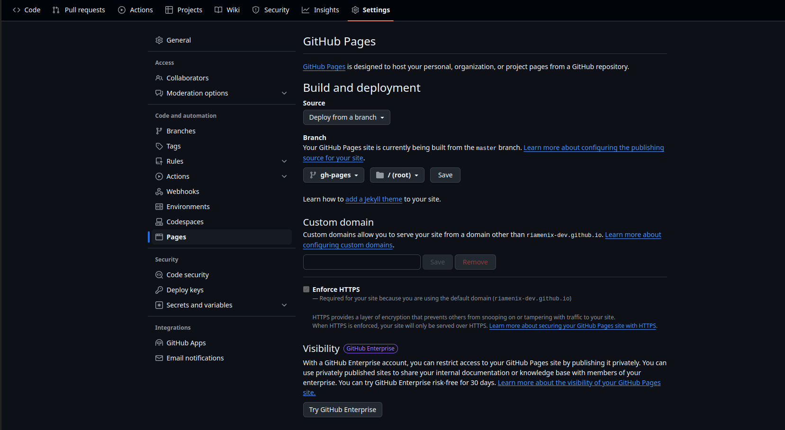
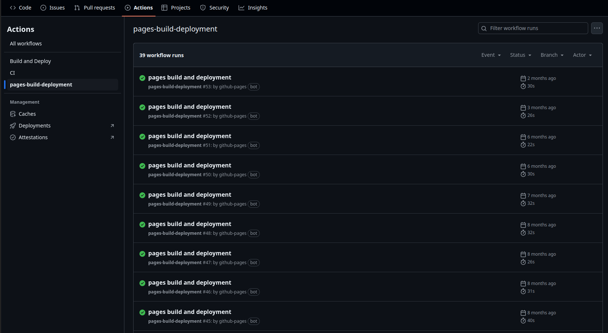

# Slick Portfolio With Svelte.

Vercel-like style portfolio template for developers.

[For a reference, check out my personal protfolio, slightly changed, but uses this template.](https://riadhadrani.github.io/RiadhAdrani)

## Create

You can either clone or fork this repository :

### `fork`

You can fork the project, maintaining a link to the original repo using the `fork` button, make sure the check the `Copy the master branch only` checkbox.



### `clone`

- using `git` :

```bash
# ssh
git clone git@github.com:RiadhAdrani/slick-portfolio-svelte.git protfolio

# https
git clone https://github.com/RiadhAdrani/slick-portfolio-svelte.git protfolio
```

- using `degit` npm executable :

```bash
npx degit RiadhAdrani/slick-portfolio-svelte portfolio
```

if you don't have `degit`, it will prompt you to accept, enter `y`.

> You can add the main repo as another remote repo to maintain updates in the future.
>
> ```bash
> # ssh
> git remote add main git@github.com:RiadhAdrani/slick-portfolio-svelte.git
> ```

## Deploy to GitHub pages

Before deploying to `GitHub Pages`:

### Enable workflows for `Forks`

If you forked the repo, go to the `Actions` tab in the newly generated repository, and enable workflows, click on the green button `I understand my workflows, go ahead and enable them` :



### Actions Settings

Allow `GitHub Pages` in your repo settings with correct permissions:
  - go to your repo `Settings` > `Actions` > `General`
  - in `Actions permissions` : make sure that `Allow all actions and reusable workflows` checkbox is checked



### svelte.config.js

Depending on the name of your repository, you would like to set the `base` variable to that, starting with a leading slash like this:

```js
const base = '/slick-portfolio-svelte';
```

But if your repository name is the same as your Github domain name; my Github name is `RiadhAdrani` so my domain name is `riadhadrani.github.io` (lower cased), and so the special repository name is also `riadhadrani.github.io`: if that is the case, you need to set the base to an empty string

```js
const base = '';

```

### Launching the build and deploy workflow

If you didn't commit and push the changes in the `svelte.config.js` yet, you can do that now, otherwise you can create an empty commit:

```bash
git commit --allow-empty -m "chore: trigger workflow"
```

and push it to your `master` or `main` branch.

In the `Actions` tab, make sure that the `Build and Deploy` workflow is successful (wait for it to complete): you should have at least one successfull workflow run:



### Enable GitHub pages


- go to your repo's `Settings` > `Pages`
- in Source section, select `Deploy from a branch`.
- in Branch section, select `gh-pages` and `/ (root)` and click on save



Again in the `Actions` tab, make sure that the `pages-build-deployment` workflow is successful (wait for it to complete): you should have at least one successfull workflow run:



> If for some reason no action was launched, try pushing empty commit.

## That's it

That's it, you can click on the latest deployment and visit it.

## Adapt to your needs

If you want to use the template as it is, you can :

- update files in `src/lib/data` with your data.
- update `src/lib/index.scss` for custom styling.
- update `static/favicon.ico` to customize the tab's icon.

But feel free to explore and hack the template to your needs if you feel like it.

## Known issues:

- Svelte no longer support `node 14`, use a newer version instead.
